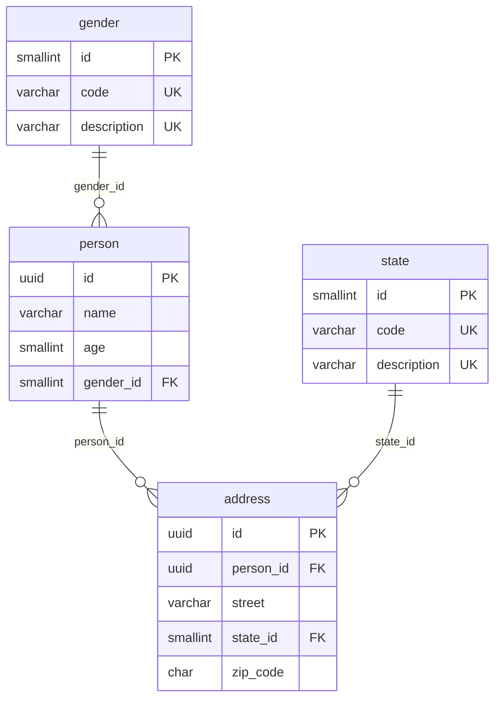
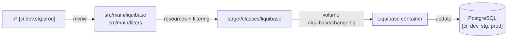

# Liquibase Reference

## Data Model



---

## ChangeLog

| Changeset                | Context | File                           | Description                                         |
|--------------------------|---------|--------------------------------|-----------------------------------------------------|
| `create-table-state`     | `ddl`   | `db.changelog-ddl-state.sql`   | Catalog `state(id, code, description)`              |
| `create-table-gender`    | `ddl`   | `db.changelog-ddl-gender.sql`  | Catalog `gender(id, code, description)`             |
| `create-table-person`    | `ddl`   | `db.changelog-ddl-person.sql`  | `person(id, name, age, gender_id)`                  |
| `create-table-address`   | `ddl`   | `db.changelog-ddl-address.sql` | `address(id, person_id, street, state_id, zip_code)` |
| `load-state-mexico`      | `dml`   | `db.changelog-dml-state.sql`   | The 32 Mexican states (`id` = INEGI key, `code` = abbreviation) |
| `load-gender`            | `dml`   | `db.changelog-dml-gender.sql`  | `M` Masculino, `F` Femenino                         |

---

## Profiles

| Profile    | Description                                                                 |
|------------|-----------------------------------------------------------------------------|
| `ci`  | Maven starts `postgres:17.10` (port `5432`) and runs Liquibase `update`.<br />Uses `ci.properties`. |
| `dev` | Runs only Liquibase `update` against a database already running outside Maven.<br />Uses `dev.properties`. |

---

## Build

### Requirements

- [Docker](https://docs.docker.com/engine/install/)

### Build Flow



---

### Continuous Integration

```shell
docker run \
  --rm \
  -w $(pwd) \
  -v $(pwd):$(pwd) \
  -v ${HOME}/.m2:/root/.m2 \
  -v /var/run/docker.sock:/var/run/docker.sock \
  azul/zulu-openjdk-alpine:25 \
  ./mvnw -Djansi.force=true -ntp -P ci -U clean verify
```

### Development Environment

```shell
docker run \
  --rm \
  -w $(pwd) \
  -v $(pwd):$(pwd) \
  -v ${HOME}/.m2:/root/.m2 \
  -v /var/run/docker.sock:/var/run/docker.sock \
  -e DEV_DATABASE_URL=jdbc:postgresql://localhost:5432/postgres \
  -e DEV_DATABASE_USERNAME=postgres \
  -e DEV_DATABASE_PASSWORD=root \
  azul/zulu-openjdk-alpine:25 \
  ./mvnw -Djansi.force=true -ntp -P dev -U clean verify
```

```shell
docker run -d \
  -p 5432:5432 \
  --name=liquibase-reference-dev \
  -e POSTGRES_PASSWORD=root \
  postgres:17.10
```
