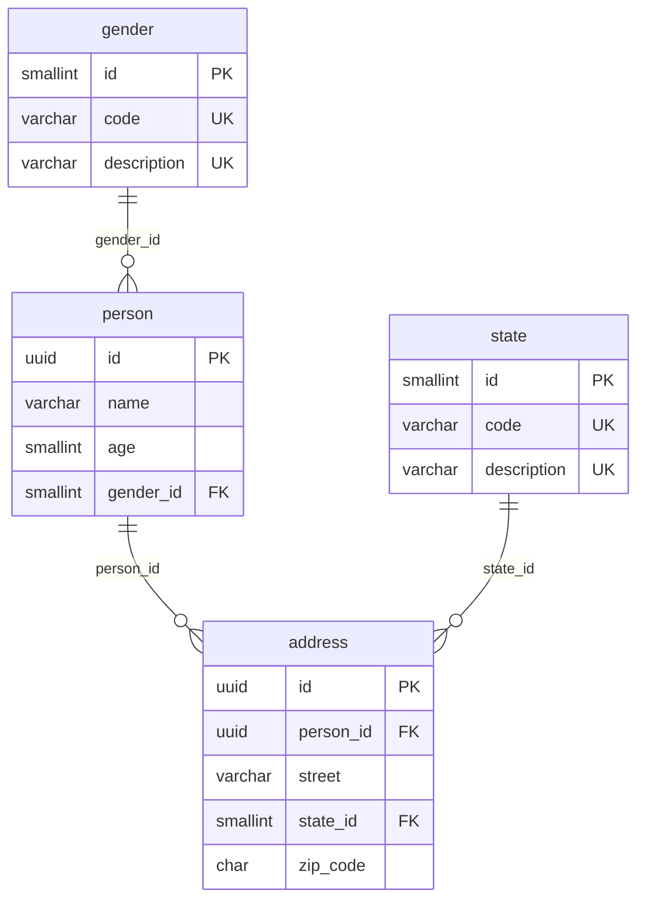
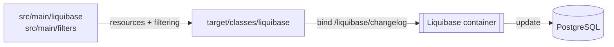

# Liquibase Reference

## Overview

| Changeset                | Context | File                           | Description                                         |
|--------------------------|---------|--------------------------------|-----------------------------------------------------|
| `create-table-state`     | `ddl`   | `db.changelog-ddl-state.sql`   | Catalog `state(id, code, description)`              |
| `create-table-gender`    | `ddl`   | `db.changelog-ddl-gender.sql`  | Catalog `gender(id, code, description)`             |
| `create-table-person`    | `ddl`   | `db.changelog-ddl-person.sql`  | `person(id, name, age, gender_id)`                  |
| `create-table-address`   | `ddl`   | `db.changelog-ddl-address.sql` | `address(id, person_id, street, state_id, zip_code)` |
| `load-state-mexico`      | `dml`   | `db.changelog-dml-state.sql`   | The 32 Mexican states (`id` = INEGI key, `code` = abbreviation) |
| `load-gender`            | `dml`   | `db.changelog-dml-gender.sql`  | `M` Masculino, `F` Femenino                         |

---

## Diagrams

### Data model



### Build flow (profile `managed`)



---

## Profiles

| Profile    | Phase                  | Description                                                                 |
|------------|------------------------|-----------------------------------------------------------------------------|
| `managed`  | `pre-integration-test`<br />and<br/>`post-integration-test` | Maven starts `postgres:17.10` (port `5432`), runs Liquibase `update`, queries the data with `psql` and stops the containers.<br />Uses `managed.properties`. |
| `external` | `pre-integration-test` | Runs only Liquibase against a database already running outside Maven, using `DATABASE_URL`, `DATABASE_USERNAME` and `DATABASE_PASSWORD`.<br />Uses `external.properties`. |

---

## Build

### Requirements

- [Docker](https://docs.docker.com/engine/install/)

### Managed

```shell
docker run \
  --rm \
  -w $(pwd) \
  -v $(pwd):$(pwd) \
  -v ${HOME}/.m2:/root/.m2 \
  -v /var/run/docker.sock:/var/run/docker.sock \
  azul/zulu-openjdk-alpine:25 \
  ./mvnw -Djansi.force=true -ntp -P managed -U clean verify
```

### External

```shell
docker run \
  --rm \
  -w $(pwd) \
  -v $(pwd):$(pwd) \
  -v ${HOME}/.m2:/root/.m2 \
  -v /var/run/docker.sock:/var/run/docker.sock \
  -e DATABASE_URL=jdbc:postgresql://*host*:**port*/*database* \
  -e DATABASE_USERNAME=*username* \
  -e DATABASE_PASSWORD=*password* \
  azul/zulu-openjdk-alpine:25 \
  ./mvnw -Djansi.force=true -ntp -P external -U clean verify
```
