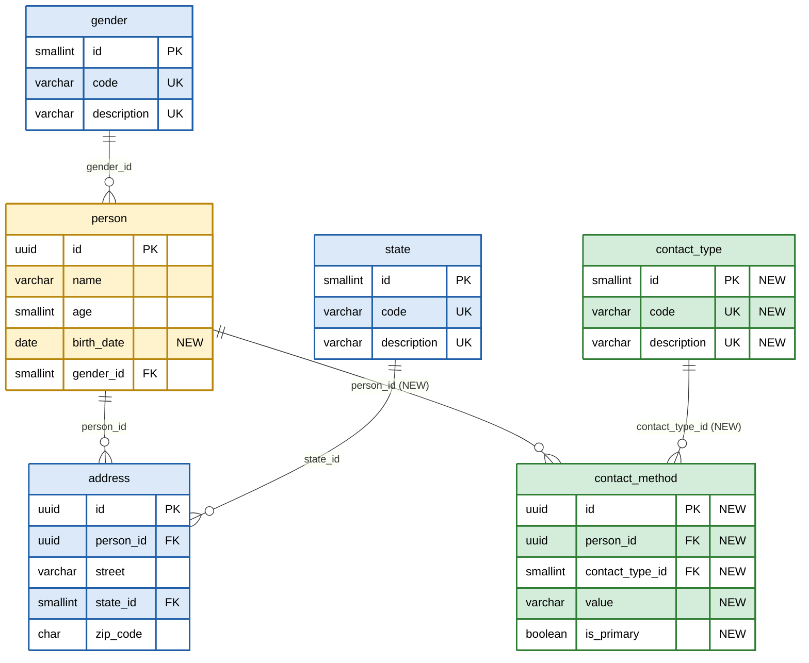
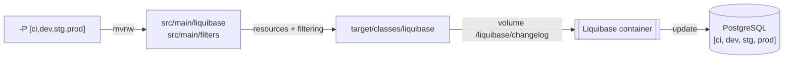

# Liquibase Reference

## Data Model

| Color | Description  |
|-------|--------------|
| 🟦    | **Baseline** |
| 🟨    | **Modified** |
| 🟩    | **New**      |



---

## ChangeLog

| Changeset                       | Context | File                                     | Description                                                                                                                                  |
|---------------------------------|---------|------------------------------------------|----------------------------------------------------------------------------------------------------------------------------------------------|
| `baseline-ddl`                  | `ddl`   | `db.changelog-ddl-baseline-schema.sql`          | Original schema from a `pg_dump` of `dev` enviroment. Marked as run when the tables already exist. |
| `baseline-dml`                  | `dml`   | `db.changelog-dml-baseline-data.sql`          | Original data from a `pg_dump` of `dev` environment. Marked as run when the catalogs already have rows. |
| `add-column-person-birth-date`  | `ddl`   | `db.changelog-ddl-person-birth-date.sql` | `person.birth_date DATE` (nullable)                                                                                                          |
| `create-table-contact-type`     | `ddl`   | `db.changelog-ddl-contact-type.sql`      | Catalog `contact_type(id, code, description)`                                                                                                |
| `create-table-contact-method`   | `ddl`   | `db.changelog-ddl-contact-method.sql`    | `contact_method(id, person_id, contact_type_id, value, is_primary)`                                                                          |
| `load-contact-type`             | `dml`   | `db.changelog-dml-contact-type.sql`      | `PHONE`, `MOBILE`, `EMAIL`                                                                                                                   |

---

## Baseline

The first two changesets (`baseline-ddl` and `baseline-dml`) are a snapshot of the schema that already existed in
`dev` environment, taken with `pg_dump`. They have `onFail:MARK_RAN` preconditions, so the same
changelog works in both profiles:

| Database                           | Baseline changesets               |
|------------------------------------|-----------------------------------|
| Empty (`ci`)                       | Executed: create the schema       |
| Already has the schema (`dev`)     | Marked as run, nothing is touched |

> [!CAUTION]
>**Never edit** an applied baseline changeset (its checksum changes); **add a new** changeset instead.

### How the baseline was obtained

Taken from the `dev` environment **before** applying any changeset that is not part of the baseline:

```shell
docker exec liquibase-reference-dev \
  pg_dump -U postgres -d postgres --schema-only \
    --no-owner --no-privileges --no-tablespaces \
    -T 'databasechangelog*' -f /tmp/baseline-schema.sql
docker cp liquibase-reference-dev:/tmp/baseline-schema.sql ./baseline-schema.sql
```

---

## Profiles

| Profile    | Description                                                                 |
|------------|-----------------------------------------------------------------------------|
| `ci`  | Maven starts `postgres:17.10` (port `5432`) and runs Liquibase `update`.<br />Uses `ci.properties`. |
| `dev` | Runs only Liquibase `update` against a database already running outside Maven.<br />Uses `dev.properties`. |

---

## Build

### Requirements

- [Docker](https://docs.docker.com/engine/install/)

### Build Flow



---

### Continuous Integration

```shell
docker run \
  --rm \
  -w $(pwd) \
  -v $(pwd):$(pwd) \
  -v ${HOME}/.m2:/root/.m2 \
  -v /var/run/docker.sock:/var/run/docker.sock \
  azul/zulu-openjdk-alpine:25 \
  ./mvnw -Djansi.force=true -ntp -P ci -U clean verify
```

### Development Environment

```shell
docker run \
  --rm \
  -w $(pwd) \
  -v $(pwd):$(pwd) \
  -v ${HOME}/.m2:/root/.m2 \
  -v /var/run/docker.sock:/var/run/docker.sock \
  -e DEV_DATABASE_URL=jdbc:postgresql://localhost:5432/postgres \
  -e DEV_DATABASE_USERNAME=postgres \
  -e DEV_DATABASE_PASSWORD=root \
  azul/zulu-openjdk-alpine:25 \
  ./mvnw -Djansi.force=true -ntp -P dev -U clean verify
```
